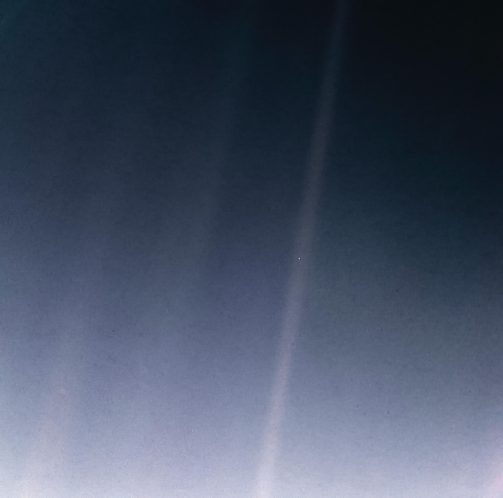

# The Voyager Story: A Whisper From the Edge
### What humanity's farthest machine teaches us about ambition, resilience, graceful decline, and building work that outlives us

*Last updated: May 2026*

---

## Prologue — A whisper from the edge

Right now, more than **15 billion miles** from Earth, a machine the size of a small car is still moving away from us at nearly **38,000 miles per hour**. Every second, it is 17 kilometers farther from home.

Its transmitter is weaker than a household light bulb — about **22 watts**. By the time that signal reaches Earth, almost a full day later, it is so faint that only the largest antennas on our planet can hear it — on the order of a tenth of a billionth of a billionth of a watt (~**10⁻¹⁹ W**). A whisper, lighter than a snowflake landing on the ground.

And yet, we are still listening.

This is the story of Voyager 1 — the farthest human-made object from Earth, a machine built for a five-year mission that became a nearly half-century lesson in science, engineering, resilience, and meaning.

For me, Voyager is not only a space mission. It is a model for how long-lived systems are built: with precision, patience, documentation, graceful trade-offs, and a mission strong enough to outlive the original builders.

---

## 1. 1977 — A door that only opens every 175 years

In the mid-1970s, the outer planets — Jupiter, Saturn, Uranus, Neptune — were drifting into an alignment that occurs roughly **once every 175 years**. A spacecraft launched in the right window could use the gravity of each planet to slingshot to the next, visiting all four worlds in a single mission. Miss the window, and the next chance would belong to a generation not yet born.

NASA built two spacecraft:

- **Voyager 2** — launched August 20, 1977
- **Voyager 1** — launched September 5, 1977, on a faster trajectory that overtook its twin by December

Each was packed with cameras, spectrometers, magnetometers, and transmitters — every instrument that could be squeezed into the mass budget. The mission was designed to last **5 years, maybe 10**. Get to Jupiter. Get to Saturn. Send the data home. Then probably fail.

It has now been **48 years**.

> **Leadership Insights — Ship to the window, not to the wish.**
> The Grand Tour was not built when the technology was ready. It was built when the *planets* were ready. The team accepted a hard, immovable deadline set by the universe itself, and bent every other constraint around it. Great missions — and great products — are shipped to the window that exists, not the one we wish we had.

---

## 2. The Golden Record — a love letter to Earth

Bolted to Voyager's side, protected by an aluminum jacket, is something that was never meant to measure a planet, detect a particle, or return a scientific reading.

It is a **12-inch gold-plated copper record** — a love letter from Earth. It carries **116 images**, music, natural sounds, greetings in **55 languages**, and instructions for whoever, or whatever, might someday find it. NASA asked **Carl Sagan** and his team to assemble the message, and they chose not only the facts of our world, but the feeling of being human.

The music spans cultures — Bach, Chuck Berry, Bulgarian folk songs, Navajo night chants. The sounds are intimate — waves, wind, a blacksmith's hammer, a mother and child, a kiss, a heartbeat. There are even the compressed brainwaves of a woman who had just fallen in love, her thoughts encoded into a minute of audio destined to drift for a billion years.

The cover of the record carries diagrams showing **how to play it**, **where Earth is** relative to fourteen pulsars, and **what time it is** in the language of atomic physics. Side A is sound. Side B encodes images as audio — pitch encodes brightness, timing encodes position, 512 lines per image, 8.3 milliseconds per line, 4.2 seconds per image. Anyone — or anything — patient enough to follow the instructions can rebuild what we sent.

It says, in the quietest possible way: **we were here, we wondered, and we wanted to be known.**

> **Leadership Insights — Make room for the part that isn't on the spec sheet.**
> The Golden Record produced zero telemetry, won no awards inside the engineering review, and added mass to a tight budget. Its job was to mean something — to make the mission worth doing even if every instrument failed. Every serious endeavor needs its golden record: the part that isn't measurable, but is the reason the rest of the work matters.

---

## 3. The Grand Tour — what two cameras saw

### Jupiter (March 1979, July 1979)

Voyager 1 flew within **174,000 miles** of the cloud tops. The Great Red Spot — a storm larger than Earth — resolved into churning detail no telescope had ever seen. Lightning in the night side. Auroras at the poles. **Four faint rings** confirmed where none were expected.

And then the moons.

- **Io** — covered in **active volcanoes**. The first time humanity had ever seen volcanic eruptions on another world.
- **Europa** — a smooth ball of ice hiding an ocean beneath.
- **Ganymede, Callisto** — worlds within worlds.

### Saturn (November 1980, August 1981)

The rings dissolved from five neat bands into **thousands of ringlets** — braided, kinked, shepherded by tiny moons we hadn't known existed. Dark, radial **spokes** on the B-ring defied simple gravitational explanations. Voyager 1 passed within **4,000 miles** of Titan and **confirmed its thick, nitrogen-rich atmosphere** — though the methane lakes on its surface would not be confirmed until the later **Cassini–Huygens** mission. **Enceladus appeared strangely bright and geologically intriguing — a clue later missions would deepen**, with Cassini ultimately confirming its active water-vapor plumes.

After Saturn, Voyager 1's trajectory bent upward — out of the plane of the solar system, away from the planets, toward interstellar space. Voyager 2 kept going across the ecliptic.

### Uranus (January 1986) — Voyager 2

A planet that was *supposed* to be boring turned out to be tilted on its side, with a magnetic field tilted another **59 degrees** off its rotation axis, eleven new moons, and **Miranda** — a fractured, patchwork world that looked like it had been shattered and reassembled.

### Neptune (August 1989) — Voyager 2

The **fastest winds in the solar system — 2,400 km/h** — howling inside the Great Dark Spot. And **Triton**, a moon with **active nitrogen geysers** erupting at -235°C, dynamic in a place no one expected anything to move.

In twelve years, two spacecraft rewrote four planets.

> **Leadership Insights — The mission you planned is the floor, not the ceiling.**
> Voyager's "primary mission" ended at Saturn. Everything after — Uranus, Neptune, the heliopause, interstellar space — was earned by people who refused to declare success and walk away. The biggest discoveries almost always live past the original scope, in the part of the roadmap nobody promised to deliver.

---

## 4. The Pale Blue Dot — looking back

In 1990, thirteen years after launch, with the cameras about to be turned off forever to save power, Carl Sagan persuaded NASA to do one last thing.

**Turn around. Look back. Take a picture of home.**

From **3.7 billion miles** away, Voyager 1 pointed its camera at Earth. The image came back as a single, almost-invisible **pale blue dot**, less than one pixel wide, caught in a band of scattered sunlight.

Every human story we carry. Every war, every empire, every love, every loss. All of it — represented in that speck.

> *"Look again at that dot. That's here. That's home. That's us."* — Carl Sagan

After that photograph, Voyager 1 turned its cameras off forever. There was nothing left to photograph. Only the darkness ahead.

> **Leadership Insights — Always take the photo looking back.**
> The Pale Blue Dot wasn't on the science plan. It was a perspective shift — an act of meaning-making at the edge of the budget. Every team, every product, every career deserves at least one moment where it stops, turns around, and sees how far it has come. That picture changes how everyone behind you understands the work.

---

## 5. August 25, 2012 — Crossing the heliopause

The Sun blows a bubble around itself called the **heliosphere** — a region carved out of the galaxy by the solar wind. The edge of that bubble is the **heliopause**: where the Sun's reach ends, and the interstellar medium begins.

On **August 25, 2012**, Voyager 1 crossed it.

For the first time in the history of our species, a human-made object had entered the space **between the stars**. Voyager 2 followed in 2018, through a different patch of the boundary, giving us — by accident of geometry — two independent measurements of where the Sun's influence finally lets go.

Where Voyager is now, sunlight is about **1/130,000** as bright as on Earth. The Sun is still the brightest point in the sky, but no warmer than any other star. The temperature outside is around **-250°C**. The density of interstellar space is roughly **one atom per cubic centimeter**. Cosmic rays — high-energy particles from exploded stars and distant galaxies — flip bits in its memory constantly, and onboard error correction quietly fixes what it can.

There is no day. No night. No sound. Just motion.

---

## 6. About time

There is something the distance does to time itself.

Voyager 1 is now nearly a full day away in light-travel time. When we receive a signal, it is almost a day old. The spacecraft that sent it has already moved more than a million kilometers further out. **We are not communicating with Voyager. We are communicating with where Voyager *was*.** Every reading is a postcard from the past.

Even here, inside our own solar system, we are already separated by time. Sunlight reaches us about 8 minutes after it leaves the Sun. A command to a Mars rover takes up to 22 minutes one way. With Voyager, the round trip is closer to two days.

Distance, beyond a certain point, *is* time. The two stop being separate things.

> **Leadership Insights — Decisions arrive from the past; commands land in the future.**
> Most of the data on a leader's desk describes a system that has already moved on. Most of the commands a leader sends will land in a future that hasn't arrived yet. The Voyager team has lived with this gap for nearly fifty years and learned to operate inside it: act on the best available evidence, account for what will have changed by the time your decision lands, and never confuse the message with the messenger's current state.

---

## 7. The 2023 glitch — the legendary save

In **November 2023**, after **46 years** of clean digital telemetry, Voyager 1 lost its voice. The stream of zeros and ones — the binary heartbeat that told us how it was feeling — became unreadable. A monotonous, unchanging dial-tone from 15 billion miles away.

A single chip in its **Flight Data System** had failed. A tiny piece of hardware, designed in the mid-1970s, finally gave way — maybe to a cosmic ray, maybe just to age.

To fix it, engineers at JPL went back to **paper schematics yellowed at the corners and signed in 1974**. They wrote a software patch for a computer with **less memory than a modern car key**. Every command they sent crossed the solar system at the speed of light — **23 hours out**, then **23 hours back** to find out whether it had worked.

For **five months**, no one knew if Voyager would ever speak intelligibly again.

Then it did. The team relocated the affected code into a different region of aging memory, and the voice came back.

The 2023 recovery was not just a technical save. **It was an operating-model save.**

A spacecraft designed in the 1970s failed in interstellar space. The people who fixed it were not the people who built it. They inherited the architecture, the documentation, the constraints, and the responsibility — and they refused to let it go silent on their watch.

This was not the first time. Decades earlier, when **Voyager 2's** primary radio receiver failed and its backup developed a faulty capacitor, engineers couldn't tune the spacecraft from Earth using the normal interface. They calculated the *exact* shifted frequencies — accounting even for the Doppler shift caused by Earth's rotation — and talked to it anyway. When the standard channel breaks, the Voyager team's answer has never been "give up." It is "find the frequency that still works."

> **Leadership Insights from the long save**
>
> ***Design for people who are not yet in the room.*** Systems that matter must be designed for people who are not yet in the room. The **architecture has to outlive the team**. The **documentation has to outlive the memory**. The **mission has to outlive the original builders**. The 2023 save happened because someone, half a century earlier, wrote things down carefully enough to be useful to strangers.
>
> ***Resilience is a culture, not a component.*** The 2023 save is not a story about clever code. It is a story about a generation of engineers who treated a 1970s spacecraft as a colleague worth saving — and a previous generation who documented their work well enough to be useful **half a century later**. The "can-do" mindset is not heroics on the day of the crisis; it is the discipline, the documentation, and the respect for the work that gets quietly invested for decades before.
>
> ***If you're stuck, change the frequency.*** When Voyager 2's primary receiver failed and the backup had a faulty capacitor, engineers calculated the *exact* shifted frequencies — accounting even for the Doppler shift caused by Earth's rotation — and talked to it anyway. When the standard interface breaks, the answer is rarely "give up." It is "find the frequency that still works."

---

## 8. The slow goodbye — the discipline of choosing what to turn off

The hardest part of Voyager's story now is not launch. It is not discovery. It is not even survival.

**It is the slow discipline of choosing what to turn off.**

Voyager is powered by three **Radioisotope Thermoelectric Generators (RTGs)** — bricks of decaying **plutonium-238** whose heat is converted into electricity by thermocouples.

- **1977:** ~470 W
- **2026:** ~215 W
- **Loss rate:** ~4 W per year
- **2030 (projected):** ~200 W

The cameras were turned off in 1990, after the Pale Blue Dot. The plasma science instrument went dark in 2007. The planetary radio astronomy instrument in 2008. In **February 2025**, the cosmic ray subsystem on Voyager 1 was switched off — not because it broke, but to keep the mission alive a little longer. On **April 17, 2026**, NASA powered down Voyager 1's **Low-Energy Charged Particle (LECP)** instrument.

As of mid-2026, **Voyager 1 has just two operating science instruments**: the **magnetometer (MAG)** and the **plasma wave subsystem (PWS)**. Voyager 2 carries a similarly trimmed payload. One by one, instruments and heaters are being retired. Each shutdown buys time. Engineers believe they can keep at least one instrument alive into the **2030s**, and the spacecraft may remain in contact until **around 2036**.

Then, one day, a signal will not arrive. We will wait the usual 23 hours. Another day. Another week. And we will know.

> **Leadership Insights — Longevity requires pruning.**
> Every watt matters. Every instrument competes with every other instrument. Keeping *everything* alive is no longer leadership. Keeping the *mission* alive is. That is a profound lesson for any long-lived platform, product, or organization: **growth requires ambition; longevity requires pruning**. The discipline is knowing what must end so the core can continue.

---

## 9. After the signal stops

When the last transmission ends, **Voyager does not stop**.

It will keep moving at roughly 38,000 mph through a void so empty that, even at that speed, it could travel thousands of years without striking anything solid. No course corrections. No adjustments. No signals home. Just motion.

- In about **40,000 years**, Voyager 1 will pass within **1.6 light-years** of a star named **Gliese 445** — not close enough to be captured, just drifting by.
- In **296,000 years**, Voyager 2 will pass within **4.3 light-years** of **Sirius**, the brightest star in our night sky.

By then, Earth will be unrecognizable. Ice ages will have come and gone. Continents will have shifted by kilometers. Species will have evolved and disappeared. Human civilization may be spread across the stars, transformed beyond recognition, or simply gone.

The Golden Record will still be there. The aluminum cover will still be bolted on. The images, the music, the 55 greetings, the heartbeat of a woman in love — all of it, intact, drifting.

And it will keep going long after that. **Five billion years** from now, our Sun will swell into a red giant, swallow Mercury and Venus, and scorch the Earth. After it does, after the planet that built Voyager is gone, Voyager will **still be out there**, moving through the galaxy in silence — a tiny machine outliving the star that made it possible.

A monument to a species that once looked up, wondered what was out there, and built something to find out.

---

## 10. What Voyager teaches us about how to work

A short field guide for builders, drawn from a 48-year mission still in progress:

1. **Ship to the window the universe gives you.** Real deadlines come from physics, customers, and rare alignments — not from internal calendars.
2. **Build the Golden Record.** Always include the part of the project that has no metric attached but carries the meaning.
3. **The mission you planned is the floor.** The biggest wins almost always live in the extended mission no one promised.
4. **Take the photo looking back.** Manufacture perspective before you lose the chance.
5. **Document for the people who haven't been hired yet.** The 2023 save happened because someone wrote things down in 1974.
6. **When the standard channel fails, change the frequency.** Most "impossible" problems are interface problems in disguise.
7. **Manage decline gracefully.** Pruning the non-essential is how the essential survives.
8. **Resilience is a culture.** It is what you invest in quietly, for decades, before the crisis arrives.
9. **Never give up.** If you ever think about it — think about Voyager. It hasn't.

---

## Epilogue — Still moving

One day, the last signal will leave Voyager.

Almost a day later, it will reach Earth.

And then there will be silence.

But Voyager will not stop.

It will keep moving after every engineer who touched it is gone.
It will keep moving after every reader of this page is gone.
It will keep moving after our cities have changed beyond recognition.
It will keep moving after the Earth itself is no longer the Earth we know.

And billions of years from now, when the Sun has exhausted the life that made this mission possible, Voyager will still be out there — silent, cold, and moving through the galaxy.

A small machine.
A human artifact.
A record of a species that once looked up, listened carefully, and chose to send a whisper into the dark.

> *For a brief moment in the darkness, we were here. And Voyager carried our proof.*

Voyager is not only a story about how far a spacecraft can travel. It is a story about how long a mission can matter.

---

## Sources and credits

This page synthesizes NASA mission material, Carl Sagan's writings, and publicly available documentary transcripts. Mission facts are stated to the best of public knowledge as of **May 2026**; later refinements (notably by **Cassini–Huygens** at Saturn and Titan) are credited to the follow-up mission. The leadership reflections are the author's own.

### Primary sources

- **NASA / Jet Propulsion Laboratory — Voyager Mission** — official mission status, instrument logs, RTG power profile, distance and velocity telemetry. <https://voyager.jpl.nasa.gov/>
- **NASA Deep Space Network (DSN)** — tracking, antenna configuration, signal-strength references. <https://www.nasa.gov/communicating-with-missions/dsn/>
- **NASA / JPL Voyager status updates** — Nov 2023–Apr 2024 Flight Data System anomaly and recovery; Feb 2025 Cosmic Ray Subsystem shutdown; Apr 17, 2026 LECP shutdown; current MAG + PWS operating configuration.
- **Carl Sagan**, *Pale Blue Dot: A Vision of the Human Future in Space* (Random House, 1994).
- **NASA Voyager Golden Record materials (1977)** — committee chaired by Carl Sagan, with Ann Druyan, Frank Drake, Jon Lomberg, Timothy Ferris, Linda Salzman Sagan, and colleagues.

### Image credits

- **Pale Blue Dot (2020 reprocessed)** — *Image credit: NASA / JPL-Caltech.* Source: [JPL Photojournal PIA23645](https://photojournal.jpl.nasa.gov/catalog/PIA23645). Used in accordance with [NASA's Media Usage Guidelines](https://www.nasa.gov/nasa-brand-center/images-and-media/): NASA imagery is generally not subject to copyright in the United States, may be used for editorial and educational purposes with appropriate credit, and such use does not imply NASA endorsement.

### Additional references

- *Voyager 1: The Last Signal From Interstellar Space* — <https://www.youtube.com/watch?v=09UwuYEp8Ac>
- *The Voyager Mission — Grand Tour of the Outer Planets* (encounter chronology)
- *The Story of Voyager 1 | Space Legends*
- *What Powers the Voyager Spacecraft / How Do Teams Fix Deep Space Communication Errors* — <https://www.youtube.com/watch?v=M62kajY-ln0>

### A note on the leadership commentary

The "Leadership Insights" callouts and the closing field guide are interpretive reflections, not NASA positions. They are written for builders, engineers, and operators of long-lived systems, drawing on the public record of the Voyager program.
